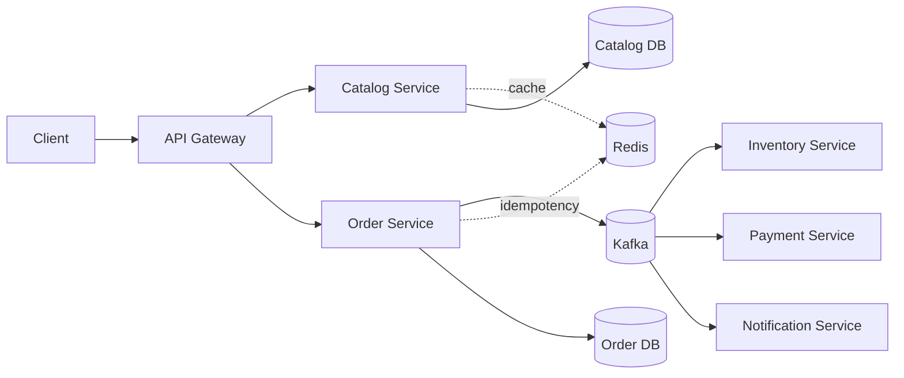

# Enterprise Commerce Platform

Production-oriented Java 21 / Spring Boot microservices reference implementation for a high-scale e-commerce platform.

## Architecture



Services own their data and communicate through versioned Kafka events. Redis is used for read-through catalog caching, distributed idempotency, and rate-limit primitives. The order workflow is designed as a saga: reserve inventory and authorize payment, then compensate on failure.

## Modules

| Module | Responsibility | Port |
|---|---|---:|
| `api-gateway` | Edge routing, future auth/rate limiting | 8080 |
| `catalog-service` | Product search and pricing | 8081 |
| `order-service` | Order aggregate and checkout orchestration | 8082 |
| `inventory-service` | Stock reservation and release | 8083 |
| `payment-service` | Payment authorization/refunds | 8084 |
| `notification-service` | Customer notifications | 8085 |
| `platform-common` | Versioned event contracts and platform web concerns | - |

## Run locally

```bash
docker compose up -d
mvn spring-boot:run -pl catalog-service
mvn spring-boot:run -pl order-service
```

`GET http://localhost:8081/api/catalog/products` and `GET http://localhost:8081/actuator/health` provide the first smoke-test surfaces. Build every module with `mvn verify`.

### Checkout smoke test

```bash
curl -X POST http://localhost:8082/api/orders \
  -H "Content-Type: application/json" -H "Idempotency-Key: demo-1001" \
  -d '{"customerId":"11111111-1111-1111-1111-111111111111","currency":"INR","amountInMinorUnits":4999,"items":[{"productId":"00000000-0000-0000-0000-000000000001","quantity":1,"unitPriceInMinorUnits":4999}]}'
```

The order service stores the idempotency response in Redis and publishes `OrderPlaced`. Inventory and payment independently consume that event and publish outcomes to Kafka; the order status endpoint reflects the latest outcome. Notification service consumes each topic with its own handler and exposes accepted deliveries at `GET /api/notifications`.

### Event choreography

`OrderPlaced` fans out to inventory, payment, and notification consumer groups. Inventory emits `InventoryReserved` or `InventoryRejected`; payment emits `PaymentAuthorized` or `PaymentFailed`. Order service consumes the outcomes to update the order, while notification service turns every business event into a customer-facing delivery command. In production, the final delivery adapter would enqueue email/SMS/push work and use an inbox table keyed by `eventId` for exactly-once business effects.

## Engineering decisions

- Database-per-service and contract-first events prevent shared-schema coupling.
- `OrderPlaced` is immutable and versioned; consumers must be idempotent using `eventId`.
- Monetary values use minor units plus an explicit ISO currency.
- `Idempotency-Key` is mandatory for order creation.
- Actuator health and Prometheus endpoints are enabled on every service.
- Production deployment should add OAuth2/OIDC at the gateway, schema migrations with Flyway, outbox publishing, Kafka retry/DLT topics, OpenTelemetry tracing, and Kubernetes HPA/PDB policies.

See [`docs/architecture.md`](docs/architecture.md) for production rollout, reliability, security, and observability guidance.
